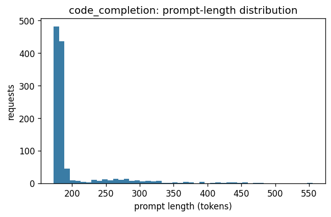
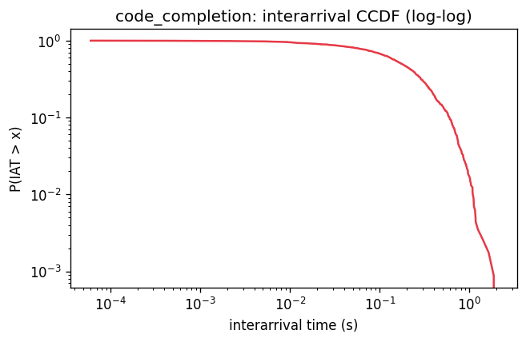
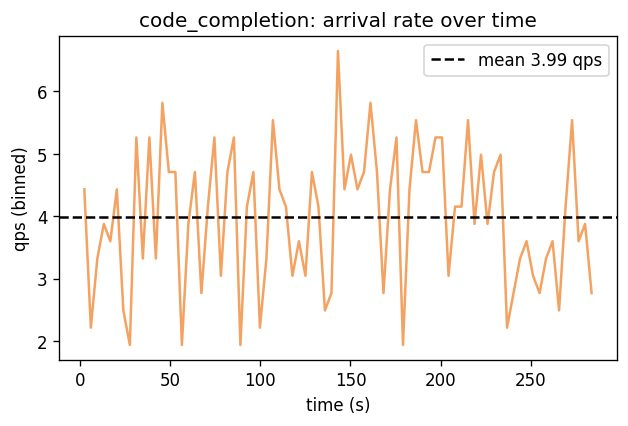
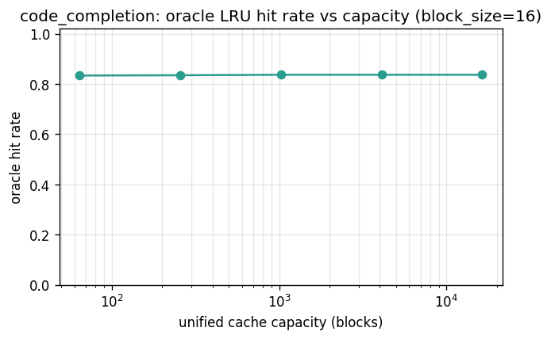

# Dataset metrics: code_completion

> code_completion is the single-turn dataset: every request is its own session (n_sessions=1,138 ≈ n_requests=1,138, turns≈1), so prefix reuse is NOT driven by conversation history — it comes entirely from the constant instruction template we prepend to every task. That template is 10 blocks; the oracle hit rate at capacity=64 blocks is 0.83, and first-block top-10 share is 1.000 (one block wins essentially all first-block slots). Routing gain above that saturation point comes from somewhere other than cross-task reuse.

## Source

- **kind**: `code_completion`
- **trace source**: `code_completion:data/code_completion/combined.jsonl`
- **loader config**:

  ```json
  {
    "max_tasks": 10000,
    "language_filter": [],
    "instruction_prefix_tokens": 165,
    "instruction_prefix_blocks_16": 10,
    "seed": 0
  }
  ```
- **loader params**:

  ```json
  {
    "arrival_rate_qps": 4.0,
    "max_output_tokens": 256,
    "tokenizer": "tiktoken:cl100k_base",
    "seed": 0
  }
  ```

## Volume

- Requests: **1,138**
- Sessions: **1,138**
- Trace duration: **285.2 s**
- Empirical QPS: **3.99**

## Prompt / output length

| metric | prompt_tokens | output_tokens_budget |
|---|---:|---:|
| n | 1,138 | 1,138 |
| mean | 197.6 | 256.0 |
| std | 47.1 | 0.0 |
| min | 173.0 | 256.0 |
| p50 | 181.0 | 256.0 |
| p90 | 258.3 | 256.0 |
| p95 | 300.1 | 256.0 |
| p99 | 418.0 | 256.0 |
| max | 555.0 | 256.0 |



## Interarrival / burstiness

- Mean IAT: **0.2508 s** (std 0.2487)
- CV² of IAT: **0.983** (≈1.0 → Poisson-like)
- Fano factor (1s windows): **1.021**
- Fano factor (10s windows): **1.643**
- Gini on interarrival gaps: **0.500**





## Prefix structure

- Block size: **16 tokens**
- Blocks per request: mean **12.0**, p50 11, p95 18
- Unique blocks: **2,236** (of 13,660 lookups)
- Block-reuse ratio: **0.836** (1 − unique/lookups)
- Unique first-blocks: **1**
- Top-10 first-blocks share: **1.000**
- First-block Zipf fit: s=**nan**, R²=nan
- All-block Zipf fit: s=**0.22**, R²=0.201

## Oracle cache hit-rate curve

Single unified LRU over blocks. Upper bound on what a prefix-aware
policy can achieve at that capacity; real multi-pod policies pay
partition overhead and will do strictly worse.

| capacity (blocks) | capacity (tokens) | hit rate |
|---:|---:|---:|
| 64 | 1,024 | 0.833 |
| 256 | 4,096 | 0.835 |
| 1,024 | 16,384 | 0.836 |
| 4,096 | 65,536 | 0.836 |
| 16,384 | 262,144 | 0.836 |



## Session / turn structure

- Turns per session: mean **1.0**, p50 1, p95 1, max 1
- Turns-per-session Gini: **0.000**
- Intra-session first-block reuse rate: **nan**

## Text statistics

- Natural language: **True**
- Empty prompts: **0**
- Degenerate prompts (<1 block): **0**
- Token-id sample (500 reqs): id range [0,100079], unique ids 2,378, mean 6639

## Reproduction

```bash
# Fetch HumanEval + MBPP into data/code_completion/ (gitignored).
python scripts/fetch_code_completion_data.py
python scripts/dataset_metrics.py --dataset code_completion
```
