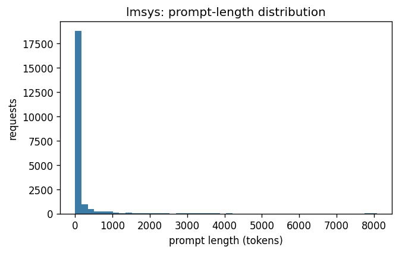
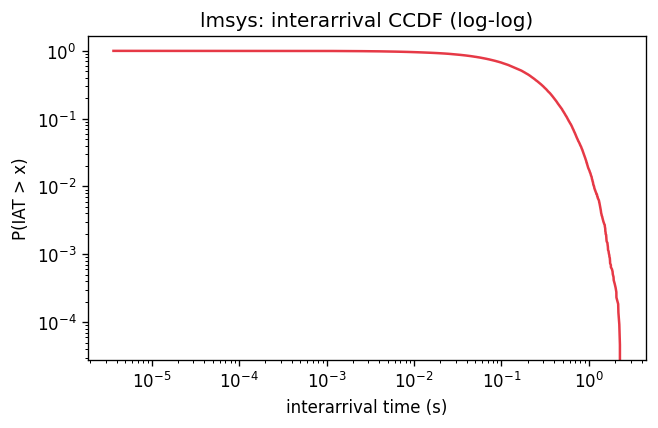
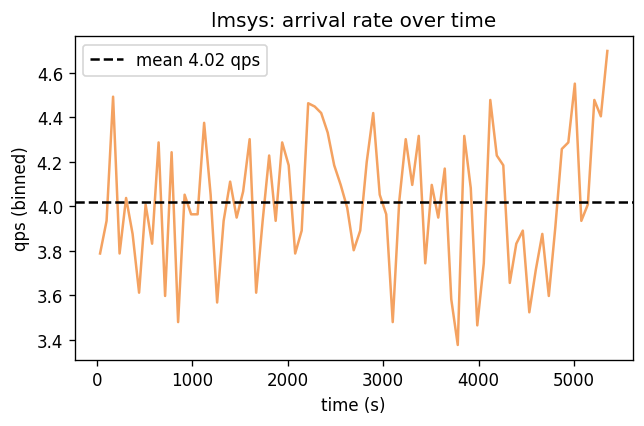
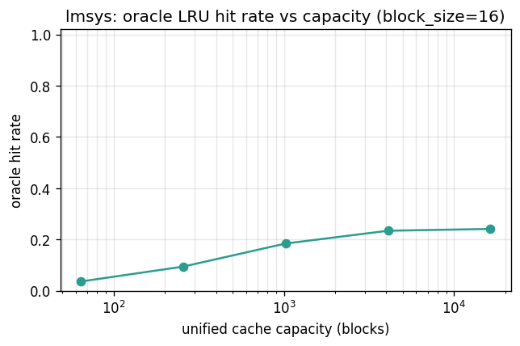

# Dataset metrics: lmsys

> lmsys is the multi-turn, real-text chat dataset (substrate: WildChat-1M (lmsys-chat-1m gated; ungated stand-in via the lmsys adapter)). n_requests=21,638 across n_sessions=9,219 (turns_per_session p95=6); prompts are heavy-tailed natural language (p50=20, p99=2756 tokens), and prefix reuse is dominated by intra-session conversation history rather than a constant template — intra-session first-block reuse rate is 0.11, oracle hit rate climbs from 0.04 at 64 blocks to 0.24 at 16384 blocks. Top language is en (45% share).

## Source

- **kind**: `lmsys`
- **trace source**: `lmsys:data/lmsys/lmsys-chat.jsonl`
- **HF dataset**: `allenai/WildChat-1M` — **substituted** because `lmsys/lmsys-chat-1m` is gated and no `HF_TOKEN` was available. The two datasets share the same JSONL conversation schema, so the lmsys workload adapter consumes them identically. Re-run with `HF_TOKEN` exported to profile the canonical dataset.
- **loader config**:

  ```json
  {
    "max_conversations": 10000,
    "language_filter": "all-languages",
    "min_turns": 1,
    "max_turns": 16,
    "seed": 0
  }
  ```
- **loader params**:

  ```json
  {
    "arrival_rate_qps": 4.0,
    "max_output_tokens": 256,
    "tokenizer": "tiktoken:cl100k_base",
    "seed": 0
  }
  ```

## Volume

- Requests: **21,638**
- Sessions: **9,219**
- Trace duration: **5380.8 s**
- Empirical QPS: **4.02**

## Prompt / output length

| metric | prompt_tokens | output_tokens_budget |
|---|---:|---:|
| n | 21,638 | 21,638 |
| mean | 151.1 | 256.0 |
| std | 553.9 | 0.0 |
| min | 1.0 | 256.0 |
| p50 | 20.0 | 256.0 |
| p90 | 263.0 | 256.0 |
| p95 | 734.0 | 256.0 |
| p99 | 2,755.6 | 256.0 |
| max | 8,079.0 | 256.0 |



## Interarrival / burstiness

- Mean IAT: **0.2487 s** (std 0.2487)
- CV² of IAT: **1.000** (≈1.0 → Poisson-like)
- Fano factor (1s windows): **1.018**
- Fano factor (10s windows): **1.047**
- Gini on interarrival gaps: **0.500**





## Prefix structure

- Block size: **16 tokens**
- Blocks per request: mean **9.0**, p50 1, p95 45
- Unique blocks: **145,789** (of 194,264 lookups)
- Block-reuse ratio: **0.250** (1 − unique/lookups)
- Unique first-blocks: **10,415**
- Top-10 first-blocks share: **0.025**
- First-block Zipf fit: s=**0.29**, R²=0.688
- All-block Zipf fit: s=**0.35**, R²=0.749

## Oracle cache hit-rate curve

Single unified LRU over blocks. Upper bound on what a prefix-aware
policy can achieve at that capacity; real multi-pod policies pay
partition overhead and will do strictly worse.

| capacity (blocks) | capacity (tokens) | hit rate |
|---:|---:|---:|
| 64 | 1,024 | 0.036 |
| 256 | 4,096 | 0.094 |
| 1,024 | 16,384 | 0.184 |
| 4,096 | 65,536 | 0.234 |
| 16,384 | 262,144 | 0.241 |



## Session / turn structure

- Turns per session: mean **2.3**, p50 2, p95 6, max 27
- Turns-per-session Gini: **0.385**
- Intra-session first-block reuse rate: **0.115**
- Prompt-length growth across turns (OLS slope, tokens/turn): mean **-29.11** over 2,963 sessions with ≥3 turns

## Language mix

- Tagged requests: **21,638**, unique languages: **62**

| lang | count | share |
|---|---:|---:|
| en | 9,714 | 0.449 |
| zh | 7,160 | 0.331 |
| ru | 2,092 | 0.097 |
| fr | 456 | 0.021 |
| es | 393 | 0.018 |
| it | 192 | 0.009 |
| tr | 189 | 0.009 |
| id | 124 | 0.006 |
| ar | 117 | 0.005 |
| ko | 106 | 0.005 |

## Text statistics

- Natural language: **True**
- Empty prompts: **0**
- Degenerate prompts (<1 block): **8,748**
- Token-id sample (500 reqs): id range [0,100161], unique ids 8,153, mean 10618

## Reproduction

```bash
# Fetch chat data into data/lmsys/ (gitignored).
# Set HF_TOKEN to access the gated lmsys/lmsys-chat-1m;
# otherwise falls back to allenai/WildChat-1M.
python scripts/fetch_lmsys_data.py --max-conversations 10000
python scripts/dataset_metrics.py --dataset lmsys
```
