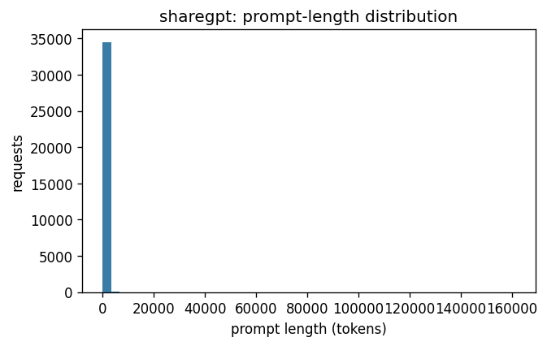
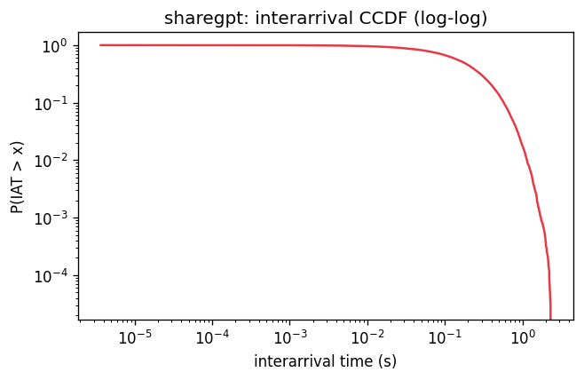
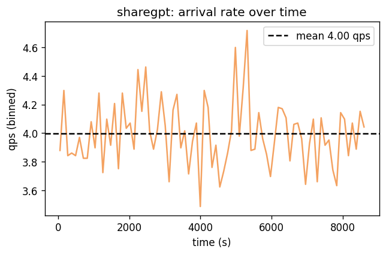
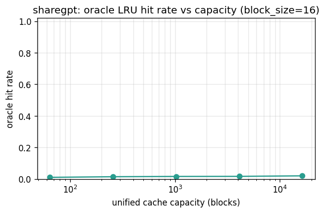

# Dataset metrics: sharegpt

> sharegpt is the long-session chat dataset with near-zero prefix reuse (substrate: sharegpt90k-parquet). Conversations run materially longer than lmsys (turns_per_session mean 4.1, p95 12, max 18) across 34,595 requests in 8,534 sessions, with a heavy-tailed prompt-length distribution (p50=20, p95=415, p99=1674, max=161280 tokens). Yet the oracle cache hit rate barely moves with capacity — 0.01 at 64 blocks rising only to 0.02 at 16,384 blocks — and block-reuse ratio is just 0.04 (lmsys reaches 0.25). Intra-session first-block reuse is 0.04, top-10 first-block share is 0.005, and first-block Zipf fit is nearly flat (s=0.13). Distinctive property: sharegpt is the stress-test for prefix-aware routing — many long sessions, but prompts are so idiosyncratic per conversation that a unified cache captures almost no reuse, so any routing gain here must come from session affinity (keeping a conversation's turns on the same pod) rather than cross-session prefix hits.

## Source

- **kind**: `sharegpt`
- **trace source**: `sharegpt:data/sharegpt/sharegpt.jsonl`
- **HF dataset**: `sharegpt90k-parquet`
- **loader config**:

  ```json
  {
    "max_conversations": 10000,
    "min_turns": 1,
    "max_turns": 32,
    "seed": 0
  }
  ```
- **loader params**:

  ```json
  {
    "arrival_rate_qps": 4.0,
    "max_output_tokens": 256,
    "tokenizer": "tiktoken:cl100k_base",
    "seed": 0
  }
  ```

## Volume

- Requests: **34,595**
- Sessions: **8,534**
- Trace duration: **8656.0 s**
- Empirical QPS: **4.00**

## Prompt / output length

| metric | prompt_tokens | output_tokens_budget |
|---|---:|---:|
| n | 34,595 | 34,595 |
| mean | 110.5 | 256.0 |
| std | 1,178.6 | 0.0 |
| min | 1.0 | 256.0 |
| p50 | 20.0 | 256.0 |
| p90 | 165.0 | 256.0 |
| p95 | 415.0 | 256.0 |
| p99 | 1,674.0 | 256.0 |
| max | 161,280.0 | 256.0 |



## Interarrival / burstiness

- Mean IAT: **0.2502 s** (std 0.2501)
- CV² of IAT: **0.999** (≈1.0 → Poisson-like)
- Fano factor (1s windows): **0.998**
- Fano factor (10s windows): **0.953**
- Gini on interarrival gaps: **0.500**





## Prefix structure

- Block size: **16 tokens**
- Blocks per request: mean **6.4**, p50 1, p95 25
- Unique blocks: **213,859** (of 222,655 lookups)
- Block-reuse ratio: **0.040** (1 − unique/lookups)
- Unique first-blocks: **19,274**
- Top-10 first-blocks share: **0.005**
- First-block Zipf fit: s=**0.13**, R²=0.481
- All-block Zipf fit: s=**0.09**, R²=0.414

## Oracle cache hit-rate curve

Single unified LRU over blocks. Upper bound on what a prefix-aware
policy can achieve at that capacity; real multi-pod policies pay
partition overhead and will do strictly worse.

| capacity (blocks) | capacity (tokens) | hit rate |
|---:|---:|---:|
| 64 | 1,024 | 0.010 |
| 256 | 4,096 | 0.014 |
| 1,024 | 16,384 | 0.016 |
| 4,096 | 65,536 | 0.016 |
| 16,384 | 262,144 | 0.020 |



## Session / turn structure

- Turns per session: mean **4.1**, p50 3, p95 12, max 18
- Turns-per-session Gini: **0.469**
- Intra-session first-block reuse rate: **0.044**
- Prompt-length growth across turns (OLS slope, tokens/turn): mean **-15.75** over 4,365 sessions with ≥3 turns

## Text statistics

- Natural language: **True**
- Empty prompts: **0**
- Degenerate prompts (<1 block): **14,112**
- Token-id sample (500 reqs): id range [0,100228], unique ids 8,543, mean 11802

## Reproduction

```bash
# Fetch ShareGPT into data/sharegpt/ (gitignored).
# Primary source: liyucheng/ShareGPT90K (parquet, streamable, ungated).
# Fallback:       anon8231489123/ShareGPT_Vicuna_unfiltered (raw JSON).
python scripts/fetch_sharegpt_data.py --max-conversations 10000
python scripts/dataset_metrics.py --dataset sharegpt
```
