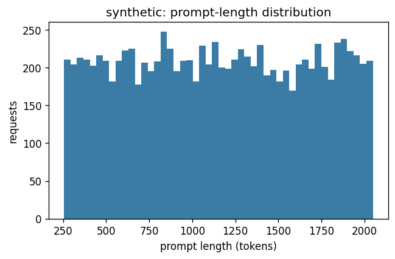
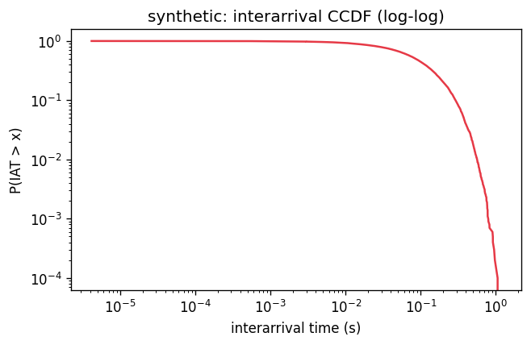
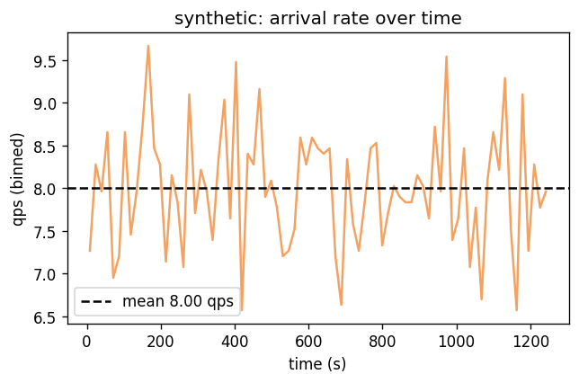
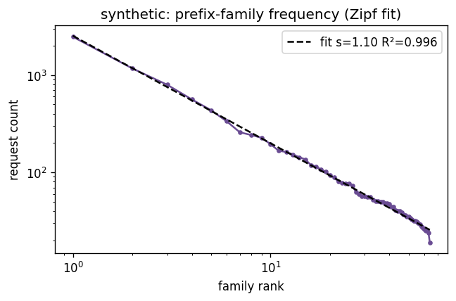
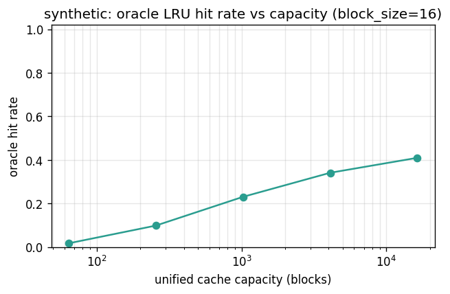

# Dataset metrics: synthetic

> Synthetic is the only dataset where arrivals are a clean homogeneous Poisson process (CV²≈0.99), prefix popularity follows a tunable Zipf law (fit s≈1.10), and cache-hit rate at capacity=1024 blocks is a knob-controlled 0.23 — the other three datasets inherit real-world burstiness and prompt structure that the synthetic trace suppresses on purpose.

## Source

- **kind**: `synthetic`
- **trace source**: `synthetic(seed=0)`
- **loader params**:

  ```json
  {
    "n_requests": 10000,
    "arrival_rate_qps": 8.0,
    "n_prefix_families": 64,
    "zipf_s": 1.1,
    "prompt_len_min": 256,
    "prompt_len_max": 2048,
    "max_output_tokens": 128,
    "n_sessions": 200,
    "seed": 0,
    "shared_prefix_tokens": 512
  }
  ```

## Volume

- Requests: **10,000**
- Sessions: **200**
- Prefix families: **64**
- Trace duration: **1250.1 s**
- Empirical QPS: **8.00**

## Prompt / output length

| metric | prompt_tokens | output_tokens_budget |
|---|---:|---:|
| n | 10,000 | 10,000 |
| mean | 1,152.6 | 128.0 |
| std | 518.7 | 0.0 |
| min | 256.0 | 128.0 |
| p50 | 1,146.0 | 128.0 |
| p90 | 1,874.0 | 128.0 |
| p95 | 1,958.0 | 128.0 |
| p99 | 2,030.0 | 128.0 |
| max | 2,048.0 | 128.0 |



## Interarrival / burstiness

- Mean IAT: **0.1250 s** (std 0.1243)
- CV² of IAT: **0.988** (≈1.0 → Poisson-like)
- Fano factor (1s windows): **0.972**
- Fano factor (10s windows): **1.407**
- Gini on interarrival gaps: **0.500**





## Prefix structure

- Block size: **16 tokens**
- Blocks per request: mean **71.6**, p50 71, p95 122
- Unique blocks: **409,937** (of 715,723 lookups)
- Block-reuse ratio: **0.427** (1 − unique/lookups)
- Unique first-blocks: **64**
- Top-10 first-blocks share: **0.670**
- First-block Zipf fit: s=**1.10**, R²=0.996
- All-block Zipf fit: s=**0.12**, R²=0.145
- Family Zipf fit: s=**1.10**, R²=0.996
- Family Gini: **0.651**, top-10 share **0.670**



## Oracle cache hit-rate curve

Single unified LRU over blocks. Upper bound on what a prefix-aware
policy can achieve at that capacity; real multi-pod policies pay
partition overhead and will do strictly worse.

| capacity (blocks) | capacity (tokens) | hit rate |
|---:|---:|---:|
| 64 | 1,024 | 0.017 |
| 256 | 4,096 | 0.098 |
| 1,024 | 16,384 | 0.230 |
| 4,096 | 65,536 | 0.341 |
| 16,384 | 262,144 | 0.409 |



## Session / turn structure

- Turns per session: mean **50.0**, p50 50, p95 61, max 70
- Turns-per-session Gini: **0.080**
- Intra-session first-block reuse rate: **0.574**
- Prompt-length growth across turns (OLS slope, tokens/turn): mean **-0.42** over 200 sessions with ≥3 turns

## Text statistics

- Natural language: **False**
- Empty prompts: **0**
- Degenerate prompts (<1 block): **0**
- Token-id sample (500 reqs): id range [0,31999], unique ids 31,998, mean 15966

## Reproduction

```bash
python scripts/dataset_metrics.py --dataset synthetic
```
